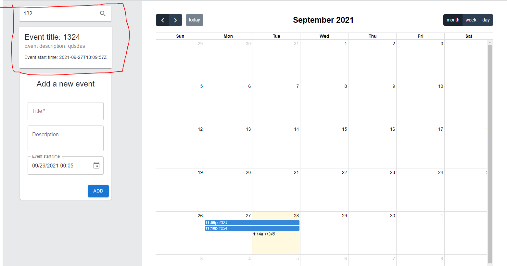
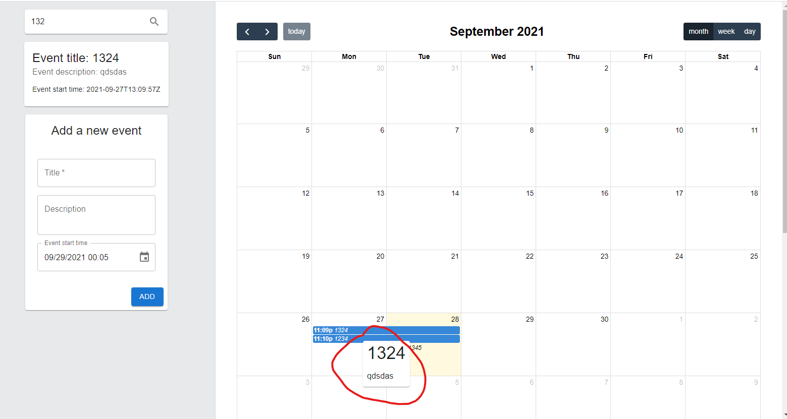
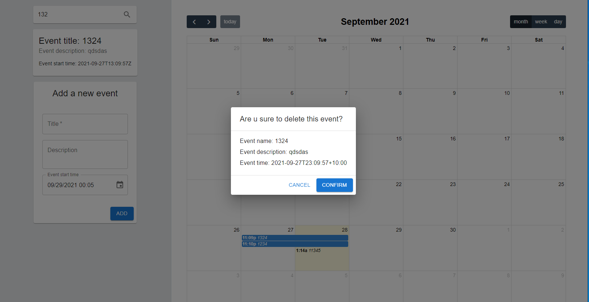

# event-calendar

## What are included

- React
- fullcalendar
- Material UI
- Redux toolkit

## install npm dependencies

`npm install`

## Run

`npm start`

## Main components

### Search

### Hover

### delete

